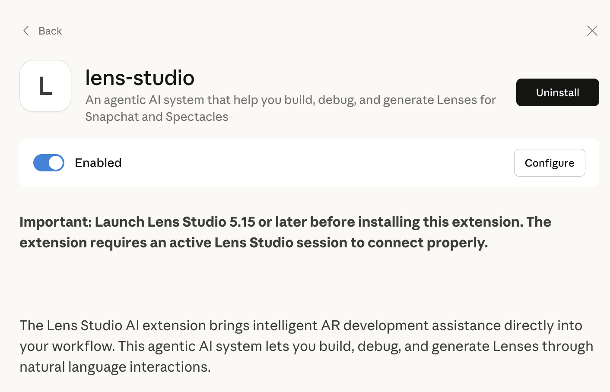

# Claude Desktop extension for Lens Studio

This extension allows Claude Desktop to interact with Snap's Lens Studio application.

**Important: Make sure Lens Studio is running before using this extension.**



## How It Works

The extension runs a local server on port 50050 that connects to Lens Studio. This allows Claude to interact with Lens Studio via MCP tools as described in the [Lens Studio AI documentation](https://developers.snap.com/lens-studio/features/lens-studio-ai/developer-mode).

## Installing from Claude Desktop

1. In Claude Desktop, go to **Connectors** → **Desktop extensions**
2. Find and install the **Lens Studio** extension

## Local Installation (for Development)

1.  **Install Dependencies:**
    ```bash
    npm install
    ```

2.  **Build & Pack the Extension:**
    ```bash
    npx mcpb pack
    ```
    This will create a `claude-desktop-extension.mcpb` file.

3.  **Install in Claude Desktop:**
    Double-click the generated `.mcpb` file to install it.

## First-Time Setup

The first time the extension connects to Lens Studio, you'll see a popup asking for permission. Click **Yes** to allow Claude Desktop to connect.

That's it! You can now use Claude to interact with Lens Studio.
